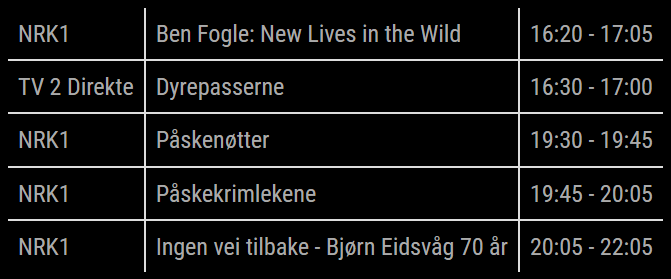

# MMM-TVGuide

The MMM-TVGuide module for MagicMirror² displays a list of TV programs fetched from a specified URL. It provides options to filter programs by channels and start time.



## Installation

1. Navigate to your MagicMirror's `modules` directory.
2. Clone this repository:
   ```sh
   git clone https://github.com/ItsMeBrille/MMM-TVGuide.git
   ```

## Configuration

To use this module, add it to the modules array in the `config/config.js` file of your MagicMirror:

```javascript
{
  module: "MMM-TVGuide",
  position: "top_right",
  config: {
    channels: ["NRK1", "TV 2 Direkte"], // List of channels
    firstTime: "19:00", // When to show result from (typically in the evening)
    maxElements: 5, // Number of elements to list (ca. 3 * `channels` length)
    updateInterval: 6 // Update interval in hours
  }
}
```

## APIs

- Fetches data using VGs API [TV-Guiden](https://tvguide.vg.no/).

## License

This project is licensed under the MIT License - see the [LICENSE](LICENSE) file for details.